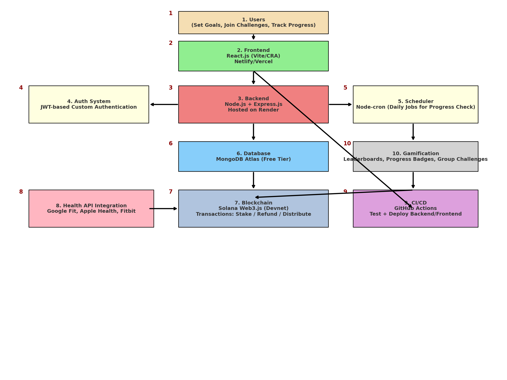

# 💪 Accountability-as-a-Service (Web3)

A goal-based financial staking platform where users commit to personal goals, stake money on their success, and compete with others for accountability and rewards. Powered by React, Node.js, MongoDB, and Solana blockchain.

---

## 🚀 Project Overview

This platform enables:
- Goal-based challenges (e.g., walk 5,000 steps daily)
- Financial staking (e.g., $300 per challenge)
- Automated progress verification via health APIs (Google Fit, Apple Health, Fitbit)
- Fair reward distribution (successful users get their stake back + rewards from failed users)
- Real-time leaderboards, badges, and community engagement

---

## 📐 Architecture Diagram

---

## 🛠 Tech Stack

### **Frontend**
- React.js (Vite / Create React App)
- Tailwind CSS
- Hosted on Netlify or Vercel

### **Backend**
- Node.js + Express.js
- MongoDB Atlas (Free Tier)
- Node-Cron (Daily Progress Jobs)
- JWT-based Custom Authentication
- Hosted on Render

### **Blockchain**
- Solana Web3.js (Devnet only)

### **Integrations**
- Google Fit, Apple Health, Fitbit APIs

### **DevOps**
- GitHub Actions (CI/CD for testing & deployment)

---

## 🔄 Core Features

| Feature                             | Description                                                 |
|------------------------------------|-------------------------------------------------------------|
| Goal-Based Challenges              | Users join challenges and commit to daily goals             |
| Financial Staking                  | Users stake money, incentivizing goal completion            |
| Health API Integration             | Automatically verifies progress (step count, etc.)          |
| Reward Distribution                | Smart backend logic or Solana Devnet transaction handling   |
| Leaderboards & Badges              | Real-time tracking, motivation via gamification             |
| Groups                             | Join public or private challenge groups                     |

---